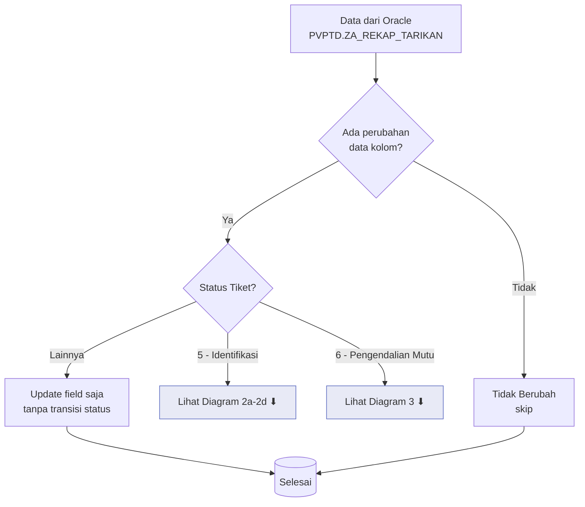
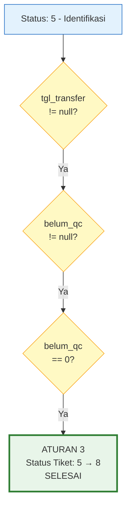
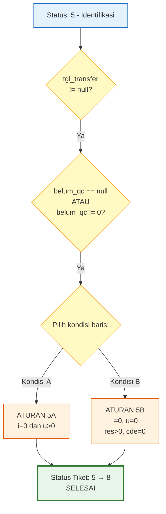
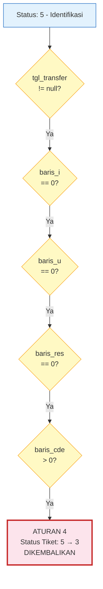
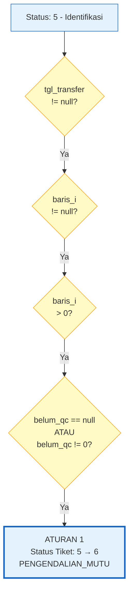
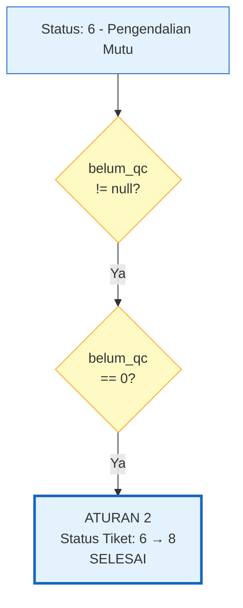

# Sinkronisasi Oracle — Aturan Transisi Status Tiket

**File**: `diamond_web/views/sync_tiket_update.py`
**Terakhir diperbarui**: 9 Juli 2026

---

## Diagram Alur Logika



### Diagram 2a — Aturan 3: Identifikasi (5) → Selesai (8) — QC Lengkap



### Diagram 2b — Aturan 5A / 5B: Identifikasi (5) → Selesai (8) — Berbasis Baris



### Diagram 2c — Aturan 4: Identifikasi (5) → Dikembalikan (3)



### Diagram 2d — Aturan 1: Identifikasi (5) → Pengendalian Mutu (6)



### Diagram 3: Keputusan di Status Pengendalian Mutu (6)



> **Keterangan singkatan**: `i` = baris_i (Identifikasi), `u` = baris_u (Update), `res` = baris_res (Residual), `cde` = baris_cde (CDE)

---

## Daftar Isi

1. [Ikhtisar](#ikhtisar)
2. [Sumber Data (Query Oracle)](#sumber-data-query-oracle)
3. [Perilaku Umum](#perilaku-umum)
4. [Aturan Transisi Status](#aturan-transisi-status)
   - [Aturan 1: Identifikasi (5) → Pengendalian Mutu (6)](#aturan-1-identifikasi-5--pengendalian-mutu-6)
   - [Aturan 2: Pengendalian Mutu (6) → Selesai (8)](#aturan-2-pengendalian-mutu-6--selesai-8)
   - [Aturan 3: Identifikasi (5) → Selesai (8) — QC Lengkap](#aturan-3-identifikasi-5--selesai-8--qc-lengkap)
   - [Aturan 4: Identifikasi (5) → Dikembalikan (3)](#aturan-4-identifikasi-5--dikembalikan-3)
   - [Aturan 5: Identifikasi (5) → Selesai (8) — Berbasis Baris](#aturan-5-identifikasi-5--selesai-8--berbasis-baris)
5. [Diagram Alur Keputusan di Status 5](#diagram-alur-keputusan-di-status-5)
6. [Ringkasan Jejak Audit TiketAction](#ringkasan-jejak-audit-tiketaction)
7. [Penugasan Peran PIC](#penugasan-peran-pic)
8. [Pelacakan Progres & Kunci Cache](#pelacakan-progres--kunci-cache)
9. [Logging & CSV](#logging--csv)
10. [Penanganan Error](#penanganan-error)

---

## Ikhtisar

Modul `sync_tiket_update` menyinkronkan kolom QC dan transfer dari Oracle (`PVPTD.ZA_REKAP_TARIKAN`) ke record `Tiket` Django lokal. Modul ini melakukan **pembaruan tingkat field** pada tiket yang cocok dan menerapkan **transisi status otomatis** dengan jejak audit lengkap (`TiketAction`) dan notifikasi.

Dua titik masuk tersedia:
- **`_check_tiket_update_data()`** — Mode *dry-run*: menghitung apa yang akan berubah tanpa memodifikasi database.
- **`_update_tiket_data()`** — Mode sinkronisasi langsung: menerapkan semua pembaruan dan transisi.

Keduanya dipanggil melalui tugas Celery (`check_tiket_update_data_task` / `sync_tiket_update_data_task`) dan dapat dihentikan di tengah eksekusi melalui sinyal berhenti berbasis *cache*.

---

## Sumber Data (Query Oracle)

Query Oracle `_TIKET_UPDATE_ORACLE_SQL` mengambil data agregat dari `PVPTD.ZA_REKAP_TARIKAN` yang dikelompokkan berdasarkan `no_tiket`.

### Kolom yang Diambil

| Kolom | Sumber | Deskripsi |
|-------|--------|-----------|
| `nomor_tiket` | `no_tiket` (dengan transformasi prefiks `EI`) | Identifikator tiket |
| `baris_i` | `SUM(JML_LOG)` | Jumlah baris identifikasi |
| `baris_u` | `SUM(JML_LOG_U)` | Jumlah baris *update* |
| `baris_res` | `SUM(JML_RES)` | Jumlah baris residual |
| `baris_cde` | `SUM(JML_CDE)` | Jumlah baris CDE |
| `tgl_transfer` | `MIN(tgl_transfer)` | Tanggal transfer ke PMDE |
| `tgl_rematch` | `MAX(tgl_rematch)` | Tanggal *rematch* |
| `tgl_close_tiket` | `CASE WHEN belum_qc=0 THEN tgl_qc ELSE NULL END` | Tanggal penyelesaian QC |
| `sudah_qc` | `COALESCE(SUM(SUDAH_QC), 0)` | Baris yang sudah di-QC |
| `belum_qc` | `COALESCE(SUM(belum_qc), 0)` | Baris yang belum di-QC |
| `lolos_qc` | `COALESCE(SUM(lolos_qc), 0)` | Baris yang lolos QC |
| `tidak_lolos_qc` | `COALESCE(SUM(TIDAK_LOLOS_QC), 0)` | Baris yang tidak lolos QC |
| `qc_p` hingga `qc_d` | `COALESCE(SUM(QC_*), 0)` | Hitungan per kategori QC |

> **Catatan**: `belum_qc` dalam query menggunakan `COALESCE(..., 0)`, sehingga selalu mengembalikan angka (0 atau lebih). Namun, kode Python memeriksa `is not None` karena kursor Oracle mentah mengembalikan `None` untuk nilai NULL dalam beberapa kasus sebelum COALESCE diterapkan.

### Transformasi Nomor Tiket

Nomor tiket dengan panjang 16 yang diawali dengan 'E' akan diganti karakter keduanya: `E...` → `EI...` (contoh: `E123456789012345` → `EI123456789012345`).

---

## Perilaku Umum

### Pembaruan Field (Semua Tiket)

Sebelum logika transisi status, field berikut dibandingkan dan diperbarui jika berubah:

- `tgl_transfer`
- `tgl_rematch`
- `baris_i`, `baris_u`, `baris_res`, `baris_cde`
- `sudah_qc`, `belum_qc`, `lolos_qc`, `tidak_lolos_qc`
- `qc_p`, `qc_x`, `qc_w`, `qc_f`, `qc_a`, `qc_c`, `qc_n`
- `qc_y`, `qc_z`, `qc_u`, `qc_e`, `qc_v`, `qc_r`, `qc_d`

Suatu tiket dianggap "berubah" hanya jika setidaknya satu field berbeda **atau** ada transisi status yang berlaku. Jika tidak ada yang berubah, akan dicatat sebagai "Tidak Berubah" dan dilewati.

### Penanganan *Timestamp*

Semua nilai *datetime* dari Oracle diproses melalui `_make_aware_datetime()`:
- Jika `USE_TZ=True`: *datetime* naif dibuat sadar zona waktu.
- Jika `USE_TZ=False`: *datetime* sadar zona waktu dihapus informasi zona waktunya.

### Pemrosesan Batch

- **SQLite**: ukuran batch 50
- **PostgreSQL**: ukuran batch 500
- **Lainnya** (Oracle, MySQL): ukuran batch 250

### Pre-fetching PIC

Semua record `TiketPIC` aktif untuk tiket yang cocok di-*pre-fetch* dengan `select_related('id_user')` dan diatur ke dalam peta: `{tiket_id: {role: [pic, ...]}}`. Peta ini digunakan untuk menetapkan pengguna ke record `TiketAction`.

---

## Aturan Transisi Status

### Aturan 1: Identifikasi (5) → Pengendalian Mutu (6)

**Nama variabel**: `needs_pmde` / `needs_pmde_transition`

#### Kondisi (semua harus benar)

| Kondisi | Deskripsi |
|---------|-----------|
| `tiket.status_tiket == STATUS_IDENTIFIKASI` (5) | Status saat ini adalah Identifikasi |
| `tgl_transfer is not None` | Oracle memiliki tanggal transfer |
| `baris_i is not None and baris_i > 0` | Ada baris identifikasi |
| `belum_qc is None or belum_qc != 0` | QC belum selesai (eksklusif dari Aturan 3 & 5) |

#### Perubahan Status

`tiket.status_tiket = STATUS_PENGENDALIAN_MUTU` (6)

#### TiketAction yang Dibuat

| Field | Nilai |
|-------|-------|
| **Aksi** | `TiketActionType.DITRANSFER_KE_PMDE` |
| **Pengguna** | PIC **PIDE** aktif pertama untuk tiket ini |
| **Waktu** | `tgl_transfer or timezone.now()` |
| **Catatan** | `'Tiket ditransfer ke PMDE'` |

#### Fallback

Jika tidak ada PIC PIDE aktif yang ditemukan, status tetap diperbarui tetapi peringatan dicatat dan tidak ada `TiketAction` yang dibuat.

#### Pencatatan (CSV)

- **Kategori**: `'Status → Pengendalian Mutu'`
- **Detail**: `'Dari IDENTIFIKASI ke PENGENDALIAN_MUTU (I:{baris_i}, U:{baris_u}, Res:{baris_res}, CDE:{baris_cde})'`

---

### Aturan 2: Pengendalian Mutu (6) → Selesai (8)

**Nama variabel**: `needs_selesai` / `needs_selesai_transition`

#### Kondisi (semua harus benar)

| Kondisi | Deskripsi |
|---------|-----------|
| `tiket.status_tiket == STATUS_PENGENDALIAN_MUTU` (6) | Status saat ini adalah Pengendalian Mutu |
| `belum_qc is not None and belum_qc == 0` | Semua QC selesai |

#### Perubahan Status

`tiket.status_tiket = STATUS_SELESAI` (8)

#### TiketAction yang Dibuat (2 aksi)

**Aksi 1: PENGENDALIAN_MUTU**
| Field | Nilai |
|-------|-------|
| **Pengguna** | PIC **PMDE** aktif pertama untuk tiket ini |
| **Waktu** | `tgl_close_tiket or timezone.now()` |
| **Catatan** | `'Tiket selesai pengendalian mutu'` |

**Aksi 2: SELESAI**
| Field | Nilai |
|-------|-------|
| **Pengguna** | PIC PMDE yang sama |
| **Waktu** | `tgl_close_tiket or timezone.now()` |
| **Catatan** | `'Tiket selesai diproses)'` |

#### Fallback

Jika tidak ada PIC PMDE aktif yang ditemukan, status tetap diperbarui tetapi peringatan dicatat dan tidak ada `TiketAction` yang dibuat.

---

### Aturan 3: Identifikasi (5) → Selesai (8) — QC Lengkap

**Nama variabel**: `needs_selesai_from_5` / `needs_selesai_from_5_transition`

#### Kondisi (semua harus benar)

| Kondisi | Deskripsi |
|---------|-----------|
| `tiket.status_tiket == STATUS_IDENTIFIKASI` (5) | Status saat ini adalah Identifikasi |
| `tgl_transfer is not None` | Oracle memiliki tanggal transfer |
| `belum_qc is not None and belum_qc == 0` | QC selesai seluruhnya |

Aturan ini menangani kasus di mana QC telah selesai di Oracle sebelum sinkronisasi berjalan — tiket dapat melewati status 6 dan langsung ke 8.

#### Perubahan Status

`tiket.status_tiket = STATUS_SELESAI` (8)

#### TiketAction yang Dibuat (3 aksi)

**Aksi 1: DITRANSFER_KE_PMDE** (oleh PIDE)
| Field | Nilai |
|-------|-------|
| **Pengguna** | PIC **PIDE** aktif pertama untuk tiket ini |
| **Waktu** | `tgl_transfer or timezone.now()` |
| **Catatan** | `'Tiket ditransfer ke PMDE'` |

**Aksi 2: PENGENDALIAN_MUTU** (oleh PMDE)
| Field | Nilai |
|-------|-------|
| **Pengguna** | PIC **PMDE** aktif pertama untuk tiket ini |
| **Waktu** | `tgl_close_tiket or timezone.now()` |
| **Catatan** | `'Tiket selesai pengendalian mutu'` |

**Aksi 3: SELESAI** (oleh PMDE)
| Field | Nilai |
|-------|-------|
| **Pengguna** | PIC PMDE yang sama |
| **Waktu** | `tgl_close_tiket or timezone.now()` |
| **Catatan** | `'Tiket selesai diproses'` |

#### Fallback

Setiap peran diselesaikan secara **independen**:
- Tidak ada PIC PIDE → aksi `DITRANSFER_KE_PMDE` dilewati dengan peringatan.
- Tidak ada PIC PMDE → aksi `PENGENDALIAN_MUTU` dan `SELESAI` dilewati dengan peringatan.

---

### Aturan 4: Identifikasi (5) → Dikembalikan (3)

**Nama variabel**: `needs_dikembalikan` / `needs_dikembalikan_transition`

#### Kondisi (semua harus benar)

| Kondisi | Deskripsi |
|---------|-----------|
| `tiket.status_tiket == STATUS_IDENTIFIKASI` (5) | Status saat ini adalah Identifikasi |
| `tgl_transfer is not None` | Oracle memiliki tanggal transfer |
| `baris_i == 0` | Tidak ada baris identifikasi |
| `baris_u == 0` | Tidak ada baris *update* |
| `baris_res == 0` | Tidak ada baris residual |
| `baris_cde > 0` | Tetapi ada baris CDE (hanya entri revisi data) |

Aturan ini mendeteksi tiket yang hanya memiliki entri CDE (koreksi/revisi data) tanpa data identifikasi/*update*/residual yang sebenarnya. Ini diperlakukan sebagai pengembalian ke P3DE untuk revisi.

#### Perubahan Status

`tiket.status_tiket = STATUS_DIKEMBALIKAN` (3)

#### Pembaruan Field Tambahan

| Field | Nilai |
|-------|-------|
| `tgl_dikembalikan` | `tgl_transfer or timezone.now()` |
| `tgl_rekam_pide` | `None` (dihapus) |

#### TiketAction yang Dibuat (2 aksi)

**Aksi 1: DIKEMBALIKAN** (oleh PIDE)
| Field | Nilai |
|-------|-------|
| **Pengguna** | PIC **PIDE** aktif pertama untuk tiket ini |
| **Waktu** | `tgl_transfer or timezone.now()` |
| **Catatan** | `'Tiket dikembalikan oleh PIDE (auto-sync)'` |

**Aksi 2: DIBATALKAN** (diatribusikan ke P3DE)
| Field | Nilai |
|-------|-------|
| **Pengguna** | PIC **P3DE** aktif pertama untuk tiket ini |
| **Waktu** | `tgl_transfer or timezone.now()` |
| **Catatan** | `'Tiket dibatalkan (dikembalikan oleh PIDE: auto-sync)'` |

#### Notifikasi

Dikirim ke **semua PIC P3DE aktif** untuk tiket ini:
- **Judul**: `'Tiket Dikembalikan'`
- **Pesan**: `'Tiket {nomor_tiket} telah dikembalikan oleh PIDE (auto-sync)'`

#### Fallback

Setiap peran diselesaikan secara **independen**:
- Tidak ada PIC PIDE → aksi `DIKEMBALIKAN` dilewati dengan peringatan.
- Tidak ada PIC P3DE → aksi `DIBATALKAN` dilewati dengan peringatan.
- Tidak ada PIC P3DE → tidak ada notifikasi yang dikirim.

---

### Aturan 5: Identifikasi (5) → Selesai (8) — Berbasis Baris

**Nama variabel**: `needs_selesai_from_5_baris` / `needs_selesai_from_5_baris_transition`

#### Kondisi (semua harus benar)

| Kondisi | Deskripsi |
|---------|-----------|
| `tiket.status_tiket == STATUS_IDENTIFIKASI` (5) | Status saat ini adalah Identifikasi |
| `tgl_transfer is not None` | Oracle memiliki tanggal transfer |
| `belum_qc is None or belum_qc != 0` | QC belum selesai (eksklusif dari Aturan 3) |
| **Kondisi A** ATAU **Kondisi B** (lihat di bawah) | Pola baris cocok |

**Kondisi A** (*update* murni — tanpa identifikasi, hanya *update*):
| Field | Nilai |
|-------|-------|
| `baris_i == 0` | Tidak ada baris identifikasi |
| `baris_u > 0` | Tetapi ada baris *update* |

**Kondisi B** (hanya residual — tanpa i/u, tanpa cde):
| Field | Nilai |
|-------|-------|
| `baris_i == 0` | Tidak ada baris identifikasi |
| `baris_u == 0` | Tidak ada baris *update* |
| `baris_res > 0` | Tetapi ada baris residual |
| `baris_cde == 0` | Tidak ada baris CDE |

Aturan ini menangani kasus tepi di mana data telah ditransfer tetapi komposisinya tidak memerlukan alur kerja PMDE penuh — baik hanya ada *update* (tanpa identifikasi) atau hanya entri residual (tanpa koreksi CDE).

#### Perubahan Status

`tiket.status_tiket = STATUS_SELESAI` (8)

#### TiketAction yang Dibuat (3 aksi)

Identik dengan Aturan 3 — **peran PIC sama, waktu sama, catatan sama**.

| Aksi | Peran PIC | Waktu | Catatan |
|------|-----------|-------|---------|
| `DITRANSFER_KE_PMDE` | PIDE | `tgl_transfer` | `'Tiket ditransfer ke PMDE'` |
| `PENGENDALIAN_MUTU` | PMDE | `tgl_close_tiket` | `'Tiket selesai pengendalian mutu'` |
| `SELESAI` | PMDE | `tgl_close_tiket` | `'Tiket selesai diproses'` |

#### Fallback

Sama seperti Aturan 3 — setiap peran diselesaikan secara independen.

---

## Diagram Alur Keputusan di Status 5

Karena beberapa aturan menargetkan status 5, berikut adalah urutan prioritasnya (semua blok `if` independen, tetapi kondisi dirancang agar saling eksklusif):

```
                     ┌─────────────────────────────────┐
                     │   Status Tiket = 5 (Identifikasi)│
                     │   tgl_transfer tidak null        │
                     └────────────┬────────────────────┘
                                  │
                    ┌─────────────┴─────────────┐
                    │                           │
              belum_qc == 0              belum_qc != 0 (atau null)
                    │                           │
                    ▼                           ▼
           ┌──────────────────┐     ┌──────────────────────────┐
           │   ATURAN 3       │     │  Periksa komposisi baris │
           │   5 → 8 (QC)     │     └────────────┬─────────────┘
           └──────────────────┘          │                    │
                                   i=0,u=0,           i=0,u>0 ATAU
                                  res=0,cde>0       i=0,u=0,res>0,
                                       │              cde==0
                                       ▼                    ▼
                              ┌──────────────┐   ┌──────────────────┐
                              │   ATURAN 4   │   │   ATURAN 5       │
                              │   5 → 3      │   │   5 → 8 (baris)  │
                              └──────────────┘   └──────────────────┘
                                       │
                                  (tidak cocok)
                                       │
                                       ▼
                              ┌──────────────────┐
                              │   ATURAN 1       │
                              │   5 → 6 (jika i>0)│
                              └──────────────────┘
```

| Prioritas | Kondisi | Aturan | Hasil |
|-----------|---------|--------|-------|
| 1 | `belum_qc == 0` | **Aturan 3** | 5 → 8 (QC lengkap) |
| 2 | `i==0, u>0` **ATAU** `i==0, u==0, res>0, cde==0` | **Aturan 5** | 5 → 8 (berbasis baris) |
| 3 | `i==0, u==0, res==0, cde>0` | **Aturan 4** | 5 → 3 (Dikembalikan) |
| 4 | `i>0` | **Aturan 1** | 5 → 6 (PMDE) |
| — | Tidak ada yang cocok | — | Tidak ada transisi |

---

## Ringkasan Jejak Audit TiketAction

### Semua Aksi yang Dibuat oleh Sinkronisasi

| Aturan | Tipe Aksi | Peran Pengguna | Sumber Waktu |
|--------|-----------|----------------|--------------|
| 1 (5→6) | `DITRANSFER_KE_PMDE` | PIDE | `tgl_transfer` |
| 2 (6→8) | `PENGENDALIAN_MUTU` | PMDE | `tgl_close_tiket` |
| 2 (6→8) | `SELESAI` | PMDE | `tgl_close_tiket` |
| 3 (5→8 QC) | `DITRANSFER_KE_PMDE` | PIDE | `tgl_transfer` |
| 3 (5→8 QC) | `PENGENDALIAN_MUTU` | PMDE | `tgl_close_tiket` |
| 3 (5→8 QC) | `SELESAI` | PMDE | `tgl_close_tiket` |
| 4 (5→3) | `DIKEMBALIKAN` | PIDE | `tgl_transfer` |
| 4 (5→3) | `DIBATALKAN` | P3DE | `tgl_transfer` |
| 5 (5→8 baris) | `DITRANSFER_KE_PMDE` | PIDE | `tgl_transfer` |
| 5 (5→8 baris) | `PENGENDALIAN_MUTU` | PMDE | `tgl_close_tiket` |
| 5 (5→8 baris) | `SELESAI` | PMDE | `tgl_close_tiket` |

---

## Penugasan Peran PIC

| Peran | Digunakan di | Tujuan |
|-------|-------------|--------|
| **PIDE** | Aturan 1, 3, 4, 5 | Membuat aksi `DITRANSFER_KE_PMDE` atau `DIKEMBALIKAN` |
| **PMDE** | Aturan 2, 3, 5 | Membuat aksi `PENGENDALIAN_MUTU` dan `SELESAI` |
| **P3DE** | Aturan 4 | Membuat aksi `DIBATALKAN` dan menerima notifikasi |

PIC diambil sebagai record `TiketPIC` dengan `active=True` untuk setiap tiket. Hanya PIC aktif **pertama** per peran yang digunakan untuk pembuatan `TiketAction`.

---

## Pelacakan Progres & Kunci Cache

### Mode Check (*Dry-Run*)

| Pola Kunci Cache | Tujuan |
|------------------|--------|
| `check_tiket_update_progress_{check_id}` | Penghitung progres saat ini |
| `check_tiket_update_done_{check_id}` | Boolean — operasi selesai |
| `check_tiket_update_in_progress_{check_id}` | Boolean — operasi berjalan |
| `check_tiket_update_result_{check_id}` | Dict hasil akhir |
| `check_tiket_update_error_{check_id}` | Pesan error jika gagal |
| `check_tiket_update_celery_task_id_{check_id}` | ID tugas Celery untuk pencabutan |
| `check_tiket_update_stop_requested_{check_id}` | Sinyal berhenti |

### Mode Sinkronisasi (Langsung)

| Pola Kunci Cache | Tujuan |
|------------------|--------|
| `tiket_update_progress_{sync_id}` | Penghitung progres saat ini |
| `tiket_update_done_{sync_id}` | Boolean — operasi selesai |
| `tiket_update_in_progress_{sync_id}` | Boolean — operasi berjalan |
| `tiket_update_result_{sync_id}` | Dict hasil akhir |
| `tiket_update_error_{sync_id}` | Pesan error jika gagal |
| `tiket_update_celery_task_id_{sync_id}` | ID tugas Celery untuk pencabutan |
| `tiket_update_stop_{sync_id}` | Sinyal berhenti |

### Struktur Data Progres

**Mode check** kunci progres:
```json
{
  "current": 0, "total": 0, "percentage": 0,
  "would_update": 0, "would_pmde": 0, "would_selesai": 0,
  "would_dikembalikan": 0, "would_unchanged": 0,
  "not_found": 0, "errors": 0
}
```

**Mode sinkronisasi** kunci progres:
```json
{
  "current": 0, "total": 0, "percentage": 0,
  "updated_rows": 0, "status_to_pmde": 0, "status_to_selesai": 0,
  "status_to_dikembalikan": 0, "not_found": 0, "unchanged": 0, "errors": 0
}
```

---

## Logging & CSV

Semua log CSV disimpan di direktori `sync_logs/` di root proyek.

### CSV Baris Gagal

**File**: `tiket_update_failed_rows_{sync_id}.csv`

| Kolom | Deskripsi |
|-------|-----------|
| `Timestamp` | Kapan error terjadi |
| `Row Number` | Indeks baris di hasil Oracle |
| `Nomor Tiket` | Identifikator tiket |
| `Error Reason` | Pesan error (dipotong hingga 200 karakter) |

### CSV Hasil

**File**: `tiket_update_result_{operation_id}.csv`

| Kolom | Deskripsi |
|-------|-----------|
| `Timestamp` | Kapan baris dicatat |
| `Nomor Tiket` | Identifikator tiket |
| `Kategori` | Salah satu dari: `Baris Diupdate`, `Belum Disinkronisasi`, `Status → Pengendalian Mutu`, `Status → Selesai`, `Status → Dikembalikan`, `Tidak Berubah`, `Error` |
| `Detail` | Konteks tambahan |

Setiap tiket dapat muncul **beberapa kali** jika termasuk dalam beberapa kategori (misalnya, "Baris Diupdate" + "Status → Pengendalian Mutu").

### Endpoint Unduhan

| Endpoint | Deskripsi |
|----------|-----------|
| `sync_tiket_update_download_errors` | Unduh `tiket_update_failed_rows_{sync_id}.csv` |
| `sync_tiket_update_download_result` | Unduh `tiket_update_result_{operation_id}.csv` |

---

## Penanganan Error

- Kesalahan pemrosesan baris individual ditangkap per baris — satu tiket yang gagal tidak memblokir seluruh sinkronisasi.
- Baris yang gagal dicatat ke CSV "baris gagal" dan dihitung dalam `errors`.
- Sinyal berhenti diperiksa setelah setiap baris — jika `stop_checker()` mengembalikan `True`, pemrosesan berhenti segera.
- Blok try/ecxcept terluar menangkap error fatal (misalnya, kegagalan koneksi Oracle, pengecualian tak terduga) dan mengembalikan hasil yang dinolkan dengan pesan error.
