# Model ER Diagram

```mermaid
erDiagram
    KategoriILAP {
        int id PK
        string id_kategori UK
        string nama_kategori UK
    }

    KategoriWilayah {
        int id PK
        string deskripsi UK
    }

    Kanwil {
        int id PK
        string kode_kanwil UK
        string nama_kanwil UK
    }

    KPP {
        int id PK
        string kode_kpp UK
        string nama_kpp UK
        int id_kanwil FK
    }

    ILAP {
        int id PK
        string id_ilap
        int id_kategori FK
        string nama_ilap
        int id_kategori_wilayah FK
        string alamat_ilap
        string kota_ilap
        string namapic_ilap
        string telp_kantor
        string fax_ilap
        string email_picilap
        string tujuan_surat
        string tembusan
        date create_date
        string create_by
        string jabatan_picilap
        string telp_pic
        date update_date
        string update_by
    }

    JenisTabel {
        int id PK
        string deskripsi UK
    }

    StatusData {
        int id PK
        string deskripsi UK
    }

    StatusPenelitian {
        int id PK
        string deskripsi UK
    }

    BentukData {
        int id PK
        string deskripsi UK
    }

    CaraPenyampaian {
        int id PK
        string deskripsi UK
    }

    MediaBackup {
        int id PK
        string deskripsi UK
    }

    DasarHukum {
        int id PK
        string kategori
        string deskripsi UK
        date start_date
        date end_date
    }

    PeriodePengiriman {
        int id PK
        string periode_penyampaian UK
        string periode_penerimaan
    }

    JenisDataILAP {
        int id PK
        int id_ilap FK
        string id_jenis_data
        string id_sub_jenis_data
        string nama_jenis_data
        string nama_sub_jenis_data
        string nama_tabel_I
        string nama_tabel_U
        int id_jenis_tabel FK
        int id_status_data FK
    }

    KlasifikasiJenisData {
        int id PK
        int id_sub_jenis_data FK
        int id_klasifikasi_tabel FK
    }

    PeriodeJenisData {
        int id PK
        int id_sub_jenis_data_ilap FK
        int id_periode_pengiriman FK
        date start_date
        date end_date
        int akhir_penyampaian
    }

    JenisPrioritasData {
        int id PK
        date start_date
        date end_date
        int id_sub_jenis_data_ilap FK
        string no_nd
        string tahun
    }

    DurasiJatuhTempo {
        int id PK
        int id_sub_jenis_data FK
        int seksi FK
        int durasi
        date start_date
        date end_date
    }

    User {
        int id PK
        string username UK
    }

    Group {
        int id PK
        string name UK
    }

    PIC {
        int id PK
        string tipe
        int id_sub_jenis_data_ilap FK
        int id_user FK
        date start_date
        date end_date
    }

    Notification {
        int id PK
        int recipient FK
        string title
        text message
        bool is_read
        datetime created_at
    }

    Tiket {
        int id PK
        string nomor_tiket UK
        bool old_db
        int status_tiket
        int id_periode_data FK
        int id_jenis_prioritas_data FK
        int periode
        int tahun
        int penyampaian
        string nomor_surat_pengantar
        datetime tanggal_surat_pengantar
        string nama_pengirim
        int id_bentuk_data FK
        int id_cara_penyampaian FK
        bool status_ketersediaan_data
        string alasan_ketidaktersediaan
        int baris_diterima
        int satuan_data
        datetime tgl_terima_vertikal
        datetime tgl_terima_dip
        bool backup
        bool tanda_terima
        int id_status_penelitian FK
        datetime tgl_teliti
        int baris_lengkap
        int baris_tidak_lengkap
        datetime tgl_nadine
        string nomor_nd_nadine
        datetime tgl_kirim_pide
        datetime tgl_dibatalkan
        datetime tgl_dikembalikan
        datetime tgl_rekam_pide
        int id_durasi_jatuh_tempo_pide FK
        int baris_i
        int baris_u
        int baris_res
        int baris_cde
        datetime tgl_transfer
        datetime tgl_rematch
        int id_durasi_jatuh_tempo_pmde FK
        int sudah_qc
        int belum_qc
        int lolos_qc
        int tidak_lolos_qc
        int qc_p
        int qc_x
        int qc_w
        int qc_f
        int qc_a
        int qc_c
        int qc_n
        int qc_y
        int qc_z
        int qc_u
        int qc_e
        int qc_v
        int qc_r
        int qc_d
    }

    TiketAction {
        int id PK
        int id_tiket FK
        int id_user FK
        datetime timestamp
        int action
        string catatan
    }

    TiketPIC {
        int id PK
        int id_tiket FK
        int id_user FK
        datetime timestamp
        int role
        bool active
    }

    TandaTerimaData {
        int id PK
        int nomor_tanda_terima
        int tahun_terima
        datetime tanggal_tanda_terima
        int id_ilap FK
        int id_perekam FK
        bool active
    }

    DetilTandaTerima {
        int id PK
        int id_tanda_terima FK
        int id_tiket FK
    }

    BackupData {
        int id PK
        int id_tiket FK
        string lokasi_backup
        string nama_file
        int id_media_backup FK
        int id_user FK
    }

    KirimPideTemp {
        int id PK
        int id_temp
        int id_tiket FK
        int id_user FK
    }

    ILAPKPP {
        int id PK
        int id_ilap FK
        int id_kpp FK
    }

    DocxTemplate {
        int id PK
        string nama_template
        text deskripsi
        string jenis_dokumen
        string file_template
        bool active
        datetime created_at
        datetime updated_at
    }

    Kanwil ||--o{ KPP : has
    KategoriILAP ||--o{ ILAP : has
    KategoriWilayah ||--o{ ILAP : has
    ILAP ||--o{ ILAPKPP : has_kpp
    KPP ||--o{ ILAPKPP : assigned_to
    ILAP ||--o{ JenisDataILAP : has
    JenisTabel ||--o{ JenisDataILAP : classified_as
    StatusData ||--o{ JenisDataILAP : has_status
    JenisDataILAP ||--o{ KlasifikasiJenisData : classified_by
    DasarHukum ||--o{ KlasifikasiJenisData : used_in
    JenisDataILAP ||--o{ PeriodeJenisData : has_periods
    PeriodePengiriman ||--o{ PeriodeJenisData : defines
    JenisDataILAP ||--o{ JenisPrioritasData : has_priorities
    JenisDataILAP ||--o{ DurasiJatuhTempo : has_durations
    Group ||--o{ DurasiJatuhTempo : assigned_to_seksi
    JenisDataILAP ||--o{ PIC : has_pics
    User ||--o{ PIC : is_pic
    User ||--o{ Notification : receives
    PeriodeJenisData ||--o{ Tiket : references
    JenisPrioritasData ||--o{ Tiket : priority
    BentukData ||--o{ Tiket : data_format
    CaraPenyampaian ||--o{ Tiket : delivery_method
    StatusPenelitian ||--o{ Tiket : research_status
    DurasiJatuhTempo ||--o{ Tiket : pide_due_date
    DurasiJatuhTempo ||--o{ Tiket : pmde_due_date
    Tiket ||--o{ TiketAction : has_actions
    User ||--o{ TiketAction : performed_by
    Tiket ||--o{ TiketPIC : has_pics
    User ||--o{ TiketPIC : assigned_as_pic
    ILAP ||--o{ TandaTerimaData : receives
    User ||--o{ TandaTerimaData : recorded_by
    TandaTerimaData ||--o{ DetilTandaTerima : contains
    Tiket ||--o{ DetilTandaTerima : included_in
    Tiket ||--o{ BackupData : has_backups
    MediaBackup ||--o{ BackupData : stored_on
    User ||--o{ BackupData : backed_up_by
    Tiket ||--o{ KirimPideTemp : has_pide_temp
    User ||--o{ KirimPideTemp : created_by
```

## Legend

| Symbol | Meaning |
|--------|---------|
| `||--o{` | One-to-Many |
| `||--||` | One-to-One |
| `UK` | Unique Key |
| `PK` | Primary Key |
| `nullable` | Field can be NULL |

## Model Groups

### Master / Reference Data (extends `AuditTrailModel`)
KategoriILAP, KategoriWilayah, Kanwil, KPP, JenisTabel, StatusData, StatusPenelitian, BentukData, CaraPenyampaian, MediaBackup, DasarHukum, PeriodePengiriman

### ILAP & Data Classification
- **ILAP** — Main entity representing an ILAP institution
- **ILAPKPP** — Relationship table linking ILAP and KPP (one ILAP can have many KPPs)
- **JenisDataILAP** — Types of data associated with each ILAP
- **KlasifikasiJenisData** — Many-to-many link between JenisDataILAP and DasarHukum
- **PeriodeJenisData** — Submission periods for each data type
- **JenisPrioritasData** — Priority designations for data types

### People & Roles
- **PIC** — Person In Charge (P3DE/PIDE/PMDE) assigned to data types
- **TiketPIC** — PIC assignments per ticket

### Tiket (Ticket/Case) System
- **Tiket** — Core ticket tracking data submissions
- **TiketAction** — Action log for tickets
- **DurasiJatuhTempo** — Due date durations per seksi (Group)

### Receipt & Backup
- **TandaTerimaData** — Receipt of data from ILAP
- **DetilTandaTerima** — Line items linking receipts to tickets
- **BackupData** — Backup records per ticket
- **KirimPideTemp** — Temporary PIDE submission records

### Supporting
- **Notification** — User notifications
- **DocxTemplate** — Document templates for report generation

---

# Detailed Model Specifications

> **Note:** Models marked with `(extends AuditTrailModel)` inherit the following abstract fields:

| Field | Type | PK | FK | Constraints | Index | Description |
|-------|------|----|----|-------------|-------|-------------|
| `create_date` | `DateField` | | | `null=True, blank=True` | | Creation date |
| `create_by` | `CharField(9)` | | | `null=True, blank=True` | | Created by user |
| `update_date` | `DateField` | | | `null=True, blank=True` | | Last update date |
| `update_by` | `CharField(9)` | | | `null=True, blank=True` | | Updated by user |

---

## Master / Reference Data

### `KategoriILAP` (extends AuditTrailModel) — `kategori_ilap`

Kategori ILAP — Kategori untuk mengelompokkan ILAP.

| Field | Type | PK | FK | Constraints | Index | Description |
|-------|------|----|----|-------------|-------|-------------|
| `id` | `AutoField` | ✅ | | | | Primary Key |
| `id_kategori` | `CharField(2)` | | | `unique=True` | | ID Kategori |
| `nama_kategori` | `CharField(50)` | | | `unique=True` | | Nama Kategori |

---

### `KategoriWilayah` (extends AuditTrailModel) — `kategori_wilayah`

Kategori Wilayah — Mengkategorikan wilayah ILAP (Nasional/Internasional, Regional).

| Field | Type | PK | FK | Constraints | Index | Description |
|-------|------|----|----|-------------|-------|-------------|
| `id` | `AutoField` | ✅ | | | | Primary Key |
| `deskripsi` | `CharField(50)` | | | `unique=True` | | Deskripsi kategori wilayah |

---

### `Kanwil` (extends AuditTrailModel) — `kanwil`

Kantor Wilayah — Data Kantor Wilayah DJP.

| Field | Type | PK | FK | Constraints | Index | Description |
|-------|------|----|----|-------------|-------|-------------|
| `id` | `AutoField` | ✅ | | | | Primary Key |
| `kode_kanwil` | `CharField(3)` | | | `unique=True` | | Kode Kanwil |
| `nama_kanwil` | `CharField(50)` | | | `unique=True` | | Nama Kanwil |

---

### `KPP` (extends AuditTrailModel) — `kpp`

Kantor Pelayanan Pajak — Data KPP yang berada di bawah Kanwil.

| Field | Type | PK | FK | Constraints | Index | Description |
|-------|------|----|----|-------------|-------|-------------|
| `id` | `AutoField` | ✅ | | | | Primary Key |
| `kode_kpp` | `CharField(3)` | | | `unique=True` | | Kode KPP |
| `nama_kpp` | `CharField(50)` | | | `unique=True` | | Nama KPP |
| `id_kanwil` | `ForeignKey` | | ✅ → `Kanwil` | `on_delete=PROTECT` | | Kanwil induk |

---

### `JenisTabel` (extends AuditTrailModel) — `jenis_tabel`

Jenis Tabel — Mengklasifikasikan jenis tabel data (Induk, Upload, dll).

| Field | Type | PK | FK | Constraints | Index | Description |
|-------|------|----|----|-------------|-------|-------------|
| `id` | `AutoField` | ✅ | | | | Primary Key |
| `deskripsi` | `CharField(50)` | | | `unique=True` | | Deskripsi jenis tabel |

---

### `StatusData` (extends AuditTrailModel) — `status_data`

Status Data — Status dari data ILAP (Aktif, Non-Aktif, dll).

| Field | Type | PK | FK | Constraints | Index | Description |
|-------|------|----|----|-------------|-------|-------------|
| `id` | `AutoField` | ✅ | | | | Primary Key |
| `deskripsi` | `CharField(25)` | | | `unique=True` | | Deskripsi status data |

---

### `StatusPenelitian` (extends AuditTrailModel) — `status_penelitian`

Status Penelitian — Status penelitian data pada tiket.

| Field | Type | PK | FK | Constraints | Index | Description |
|-------|------|----|----|-------------|-------|-------------|
| `id` | `AutoField` | ✅ | | | | Primary Key |
| `deskripsi` | `CharField(25)` | | | `unique=True` | | Deskripsi status penelitian |

---

### `BentukData` (extends AuditTrailModel) — `bentuk_data`

Bentuk Data — Bentuk fisik/logis data yang diserahkan (CD, Hardcopy, Email, dll).

| Field | Type | PK | FK | Constraints | Index | Description |
|-------|------|----|----|-------------|-------|-------------|
| `id` | `AutoField` | ✅ | | | | Primary Key |
| `deskripsi` | `CharField(25)` | | | `unique=True` | | Deskripsi bentuk data |

---

### `CaraPenyampaian` (extends AuditTrailModel) — `cara_penyampaian`

Cara Penyampaian — Cara penyampaian data oleh ILAP.

| Field | Type | PK | FK | Constraints | Index | Description |
|-------|------|----|----|-------------|-------|-------------|
| `id` | `AutoField` | ✅ | | | | Primary Key |
| `deskripsi` | `CharField(25)` | | | `unique=True` | | Deskripsi cara penyampaian |

---

### `MediaBackup` (extends AuditTrailModel) — `media_backup`

Media Backup — Media penyimpanan backup data.

| Field | Type | PK | FK | Constraints | Index | Description |
|-------|------|----|----|-------------|-------|-------------|
| `id` | `AutoField` | ✅ | | | | Primary Key |
| `deskripsi` | `CharField(25)` | | | `unique=True` | | Deskripsi media backup |

---

### `DasarHukum` (extends AuditTrailModel) — `dasar_hukum`

Dasar Hukum — Dasar hukum/acuan pertukaran data (PMK, KMK, PKS, MOU, dll).

| Field | Type | PK | FK | Constraints | Index | Description |
|-------|------|----|----|-------------|-------|-------------|
| `id` | `AutoField` | ✅ | | | | Primary Key |
| `kategori` | `CharField(10)` | | | `choices=KATEGORI_CHOICES` | | Kategori dasar hukum (DAPEN, EOI, KMK, KSWP, MOU, PKD, PKS, PMK) |
| `deskripsi` | `CharField(50)` | | | `unique=True` | | Deskripsi dasar hukum |
| `start_date` | `DateField` | | | `null=True, blank=True` | | Tanggal mulai berlaku |
| `end_date` | `DateField` | | | `null=True, blank=True` | | Tanggal berakhir berlaku |

---

### `PeriodePengiriman` (extends AuditTrailModel) — `periode_pengiriman`

Periode Pengiriman — Periode waktu penyampaian dan penerimaan data.

| Field | Type | PK | FK | Constraints | Index | Description |
|-------|------|----|----|-------------|-------|-------------|
| `id` | `AutoField` | ✅ | | | | Primary Key |
| `periode_penyampaian` | `CharField(50)` | | | `unique=True` | | Periode penyampaian |
| `periode_penerimaan` | `CharField(50)` | | | | | Periode penerimaan |

---

## ILAP & Data Classification

### `ILAP` — `ilap`

Institusi Penerima Data (ILAP) — Entitas utama yang menerima dan mengelola data.

| Field | Type | PK | FK | Constraints | Index | Description |
|-------|------|----|----|-------------|-------|-------------|
| `id` | `AutoField` | ✅ | | | | Primary Key |
| `id_ilap` | `CharField(5)` | | | | ✅ `ilap_id_ilap_idx` | ID ILAP |
| `id_kategori` | `ForeignKey` | | ✅ → `KategoriILAP` | `on_delete=PROTECT` | ✅ `ilap_kategori_idx` | Kategori ILAP |
| `nama_ilap` | `CharField(150)` | | | | | Nama ILAP |
| `id_kategori_wilayah` | `ForeignKey` | | ✅ → `KategoriWilayah` | `on_delete=PROTECT` | ✅ `ilap_kwil_idx` | Kategori Wilayah |
| `alamat_ilap` | `CharField(3000)` | | | `null=True, blank=True` | | Alamat ILAP |
| `kota_ilap` | `CharField(30)` | | | `null=True, blank=True` | | Kota ILAP |
| `namapic_ilap` | `CharField(100)` | | | `null=True, blank=True` | | Nama PIC ILAP |
| `telp_kantor` | `CharField(100)` | | | `null=True, blank=True` | | Telepon kantor |
| `fax_ilap` | `CharField(100)` | | | `null=True, blank=True` | | Fax ILAP |
| `email_picilap` | `CharField(100)` | | | `null=True, blank=True` | | Email PIC ILAP |
| `create_date` | `DateField` | | | `null=True, blank=True` | | Tanggal dibuat |
| `create_by` | `CharField(9)` | | | `null=True, blank=True` | | Dibuat oleh |
| `jabatan_picilap` | `CharField(100)` | | | `null=True, blank=True` | | Jabatan PIC ILAP |
| `telp_pic` | `CharField(100)` | | | `null=True, blank=True` | | Telepon PIC |
| `tujuan_surat` | `CharField(200)` | | | `null=True, blank=True` | | Tujuan surat |
| `tembusan` | `CharField(200)` | | | `null=True, blank=True` | | Tembusan surat |
| `update_date` | `DateField` | | | `null=True, blank=True` | | Tanggal diperbarui |
| `update_by` | `CharField(9)` | | | `null=True, blank=True` | | Diperbarui oleh |

**Composite Constraints:** `UniqueConstraint(fields=["id_ilap", "nama_ilap"], name="unique_ilap_id_nama")`

---

### `ILAPKPP` — `ilap_kpp`

ILAP KPP — Tabel relasi antara ILAP dan KPP (satu ILAP dapat memiliki banyak KPP).

| Field | Type | PK | FK | Constraints | Index | Description |
|-------|------|----|----|-------------|-------|-------------|
| `id` | `AutoField` | ✅ | | | | Primary Key |
| `id_ilap` | `ForeignKey` | | ✅ → `ILAP` | `on_delete=PROTECT` | ✅ `ilk_id_ilap_idx` | ILAP terkait |
| `id_kpp` | `ForeignKey` | | ✅ → `KPP` | `on_delete=PROTECT` | ✅ `ilk_id_kpp_idx` | KPP terkait |

---

### `JenisDataILAP` (extends AuditTrailModel) — `jenis_data_ilap`

Jenis Data ILAP — Tipe-tipe data yang terkait dengan masing-masing ILAP.

| Field | Type | PK | FK | Constraints | Index | Description |
|-------|------|----|----|-------------|-------|-------------|
| `id` | `AutoField` | ✅ | | | | Primary Key |
| `id_ilap` | `ForeignKey` | | ✅ → `ILAP` | `on_delete=PROTECT` | ✅ `jdi_id_ilap_idx` | ILAP terkait |
| `id_jenis_data` | `CharField(7)` | | | | ✅ `jdi_jenis_idx` | ID Jenis Data |
| `id_sub_jenis_data` | `CharField(9)` | | | | ✅ `jdi_subjenis_idx`, ✅ `jdi_ilap_sub_idx` | ID Sub Jenis Data |
| `nama_jenis_data` | `CharField(255)` | | | | | Nama Jenis Data |
| `nama_sub_jenis_data` | `CharField(255)` | | | | | Nama Sub Jenis Data |
| `nama_tabel_I` | `CharField(255)` | | | | | Nama Tabel Induk |
| `nama_tabel_U` | `CharField(255)` | | | | | Nama Tabel Upload |
| `id_jenis_tabel` | `ForeignKey` | | ✅ → `JenisTabel` | `on_delete=PROTECT` | ✅ `jdi_jtabel_idx` | Jenis Tabel |
| `id_status_data` | `ForeignKey` | | ✅ → `StatusData` | `on_delete=PROTECT, null=True, blank=True` | ✅ `jdi_status_idx` | Status Data |

**Composite Indexes:** `jdi_ilap_sub_idx` on (`id_ilap`, `id_sub_jenis_data`)

---

### `KlasifikasiJenisData` (extends AuditTrailModel) — `klasifikasi_jenis_data`

Klasifikasi Jenis Data — Hubungan many-to-many antara JenisDataILAP dan DasarHukum.

| Field | Type | PK | FK | Constraints | Index | Description |
|-------|------|----|----|-------------|-------|-------------|
| `id` | `AutoField` | ✅ | | | | Primary Key |
| `id_sub_jenis_data` | `ForeignKey` | | ✅ → `JenisDataILAP` | `on_delete=PROTECT` | ✅ `kjd_subjenis_idx` | Sub Jenis Data ILAP |
| `id_klasifikasi_tabel` | `ForeignKey` | | ✅ → `DasarHukum` | `on_delete=PROTECT` | ✅ `kjd_klasif_idx` | Dasar Hukum |

**Composite Constraints:** `unique_together = [['id_sub_jenis_data', 'id_klasifikasi_tabel']]`

---

### `PeriodeJenisData` (extends AuditTrailModel) — `periode_jenis_data`

Periode Jenis Data — Periode pengiriman untuk setiap jenis data.

| Field | Type | PK | FK | Constraints | Index | Description |
|-------|------|----|----|-------------|-------|-------------|
| `id` | `AutoField` | ✅ | | | | Primary Key |
| `id_sub_jenis_data_ilap` | `ForeignKey` | | ✅ → `JenisDataILAP` | `on_delete=PROTECT` | ✅ `pjd_subjenis_idx`, ✅ `pjd_sub_per_idx`, ✅ `pjd_sub_start_idx` | Sub Jenis Data ILAP |
| `id_periode_pengiriman` | `ForeignKey` | | ✅ → `PeriodePengiriman` | `on_delete=PROTECT` | ✅ `pjd_periode_idx`, ✅ `pjd_sub_per_idx` | Periode Pengiriman |
| `start_date` | `DateField` | | | | ✅ `pjd_start_idx`, ✅ `pjd_sub_start_idx` | Tanggal mulai |
| `end_date` | `DateField` | | | `null=True, blank=True, default=None` | ✅ `pjd_end_idx` | Tanggal berakhir |
| `akhir_penyampaian` | `IntegerField` | | | | | Batas akhir penyampaian (hari) |

**Composite Indexes:**
- `pjd_sub_per_idx` on (`id_sub_jenis_data_ilap`, `id_periode_pengiriman`)
- `pjd_sub_start_idx` on (`id_sub_jenis_data_ilap`, `start_date`)

---

### `JenisPrioritasData` (extends AuditTrailModel) — `jenis_prioritas_data`

Jenis Prioritas Data — Penetapan prioritas untuk jenis data.

| Field | Type | PK | FK | Constraints | Index | Description |
|-------|------|----|----|-------------|-------|-------------|
| `id` | `AutoField` | ✅ | | | | Primary Key |
| `start_date` | `DateField` | | | | | Tanggal mulai |
| `end_date` | `DateField` | | | `null=True, blank=True, default=None` | | Tanggal berakhir |
| `id_sub_jenis_data_ilap` | `ForeignKey` | | ✅ → `JenisDataILAP` | `on_delete=PROTECT` | | Sub Jenis Data ILAP |
| `no_nd` | `CharField(20)` | | | | | Nomor ND |
| `tahun` | `CharField(4)` | | | | | Tahun |

**Composite Constraints:** `UniqueConstraint(fields=['id_sub_jenis_data_ilap', 'tahun'], name='unique_subjenis_tahun')`

---

### `DurasiJatuhTempo` (extends AuditTrailModel) — `durasi_jatuh_tempo`

Durasi Jatuh Tempo — Durasi waktu jatuh tempo per seksi (Group).

| Field | Type | PK | FK | Constraints | Index | Description |
|-------|------|----|----|-------------|-------|-------------|
| `id` | `AutoField` | ✅ | | | | Primary Key |
| `id_sub_jenis_data` | `ForeignKey` | | ✅ → `JenisDataILAP` | `on_delete=PROTECT` | | Sub Jenis Data ILAP |
| `seksi` | `ForeignKey` | | ✅ → `Group` (auth) | `on_delete=PROTECT` | | Seksi/Grup penanggung jawab |
| `durasi` | `IntegerField` | | | | | Durasi (hari) |
| `start_date` | `DateField` | | | | | Tanggal mulai |
| `end_date` | `DateField` | | | `null=True, blank=True, default=None` | | Tanggal berakhir |

---

## People & Roles

### `PIC` (extends AuditTrailModel) — `pic`

Person In Charge — PIC P3DE/PIDE/PMDE yang ditugaskan ke jenis data.

| Field | Type | PK | FK | Constraints | Index | Description |
|-------|------|----|----|-------------|-------|-------------|
| `id` | `AutoField` | ✅ | | | | Primary Key |
| `tipe` | `CharField(10)` | | | `choices=TipePIC (P3DE, PIDE, PMDE)` | ✅ `pic_tipe_sub_idx`, ✅ `pic_sub_active_idx`, ✅ `pic_user_tipe_idx` | Tipe PIC |
| `id_sub_jenis_data_ilap` | `ForeignKey` | | ✅ → `JenisDataILAP` | `on_delete=PROTECT` | ✅ `pic_tipe_sub_idx`, ✅ `pic_sub_active_idx` | Sub Jenis Data ILAP |
| `id_user` | `ForeignKey` | | ✅ → `User` (auth) | `on_delete=PROTECT` | ✅ `pic_user_tipe_idx` | User PIC |
| `start_date` | `DateField` | | | | ✅ `pic_sub_active_idx` | Tanggal mulai penugasan |
| `end_date` | `DateField` | | | `null=True, blank=True, default=None` | ✅ `pic_sub_active_idx`, ✅ `pic_user_tipe_idx` | Tanggal berakhir penugasan |

**Composite Indexes:**
- `pic_tipe_sub_idx` on (`tipe`, `id_sub_jenis_data_ilap`)
- `pic_sub_active_idx` on (`id_sub_jenis_data_ilap`, `tipe`, `start_date`, `end_date`)
- `pic_user_tipe_idx` on (`id_user`, `tipe`, `end_date`)

---

### `TiketPIC` — `tiket_pic`

PIC Tiket — Penugasan PIC pada tiket tertentu.

| Field | Type | PK | FK | Constraints | Index | Description |
|-------|------|----|----|-------------|-------|-------------|
| `id` | `AutoField` | ✅ | | | | Primary Key |
| `id_tiket` | `ForeignKey` | | ✅ → `Tiket` | `on_delete=PROTECT` | | Tiket terkait |
| `id_user` | `ForeignKey` | | ✅ → `User` (auth) | `on_delete=PROTECT` | | User PIC |
| `timestamp` | `DateTimeField` | | | | | Waktu penugasan |
| `role` | `IntegerField` | | | `choices=Role (1=P3DE, 2=PIDE, 3=PMDE)` | | Role PIC |
| `active` | `BooleanField` | | | `default=True` | | Status aktif |

---

## Tiket (Ticket/Case) System

### `Tiket` — `tiket`

Tiket — Inti sistem pelacakan pengajuan data.

| Field | Type | PK | FK | Constraints | Index | Description |
|-------|------|----|----|-------------|-------|-------------|
| `id` | `AutoField` | ✅ | | | | Primary Key |
| `nomor_tiket` | `CharField(17)` | | | `unique=True` | | Nomor Tiket unik |
| `old_db` | `BooleanField` | | | `default=False` | | Berasal dari DB lama |
| `status_tiket` | `IntegerField` | | | `choices=STATUS_CHOICES` | | Status tiket |
| `id_periode_data` | `ForeignKey` | | ✅ → `PeriodeJenisData` | `on_delete=PROTECT` | ✅ `tiket_periode_data_idx`, ✅ `tiket_lookup_idx` | Periode Jenis Data |
| `id_jenis_prioritas_data` | `ForeignKey` | | ✅ → `JenisPrioritasData` | `on_delete=PROTECT, null=True, blank=True` | | Jenis Prioritas Data |
| `periode` | `IntegerField` | | | | ✅ `tiket_thn_prd_idx`, ✅ `tiket_lookup_idx` | Periode |
| `tahun` | `IntegerField` | | | | ✅ `tiket_thn_prd_idx`, ✅ `tiket_lookup_idx` | Tahun |
| `penyampaian` | `IntegerField` | | | `default=0` | ✅ `tiket_penyampaian_idx`, ✅ `tiket_lookup_idx` | Penyampaian ke- |
| `nomor_surat_pengantar` | `CharField(80)` | | | `blank=True` | | Nomor surat pengantar |
| `tanggal_surat_pengantar` | `DateTimeField` | | | `null=True, blank=True` | | Tanggal surat pengantar |
| `nama_pengirim` | `CharField(50)` | | | `blank=True` | | Nama pengirim |
| `id_bentuk_data` | `ForeignKey` | | ✅ → `BentukData` | `on_delete=PROTECT` | | Bentuk data |
| `id_cara_penyampaian` | `ForeignKey` | | ✅ → `CaraPenyampaian` | `on_delete=PROTECT` | | Cara penyampaian |
| `status_ketersediaan_data` | `BooleanField` | | | `default=True` | | Ketersediaan data |
| `alasan_ketidaktersediaan` | `CharField(100)` | | | `null=True, blank=True` | | Alasan data tidak tersedia |
| `baris_diterima` | `IntegerField` | | | | | Jumlah baris diterima |
| `satuan_data` | `IntegerField` | | | `default=1, choices=SATUAN_DATA_CHOICES` | | Satuan data |
| `tgl_terima_vertikal` | `DateTimeField` | | | `null=True, blank=True` | ✅ `tiket_terima_vert_idx` | Tanggal terima vertikal |
| `tgl_terima_dip` | `DateTimeField` | | | | ✅ `tiket_terima_dip_idx` | Tanggal terima DIP |
| `backup` | `BooleanField` | | | `default=False` | | Status backup direkam |
| `tanda_terima` | `BooleanField` | | | `default=False` | | Status tanda terima dibuat |
| `id_status_penelitian` | `ForeignKey` | | ✅ → `StatusPenelitian` | `on_delete=PROTECT, null=True, blank=True` | | Status penelitian |
| `tgl_teliti` | `DateTimeField` | | | `null=True, blank=True` | | Tanggal diteliti |
| `baris_lengkap` | `IntegerField` | | | `null=True, blank=True` | | Baris data lengkap |
| `baris_tidak_lengkap` | `IntegerField` | | | `null=True, blank=True` | | Baris data tidak lengkap |
| `tgl_nadine` | `DateTimeField` | | | `null=True, blank=True` | | Tanggal Nadine |
| `nomor_nd_nadine` | `CharField(255)` | | | `null=True, blank=True` | | Nomor ND Nadine |
| `tgl_kirim_pide` | `DateTimeField` | | | `null=True, blank=True` | | Tanggal kirim PIDE |
| `tgl_dibatalkan` | `DateTimeField` | | | `null=True, blank=True` | | Tanggal dibatalkan |
| `tgl_dikembalikan` | `DateTimeField` | | | `null=True, blank=True` | | Tanggal dikembalikan |
| `tgl_rekam_pide` | `DateTimeField` | | | `null=True, blank=True` | | Tanggal rekam PIDE |
| `id_durasi_jatuh_tempo_pide` | `ForeignKey` | | ✅ → `DurasiJatuhTempo` | `on_delete=PROTECT, null=True, blank=True, related_name='durasi_jatuh_tempo_pide_tikets'` | | Durasi jatuh tempo PIDE |
| `baris_i` | `IntegerField` | | | `null=True, blank=True` | | Baris Induk |
| `baris_u` | `IntegerField` | | | `null=True, blank=True` | | Baris Upload |
| `baris_res` | `IntegerField` | | | `null=True, blank=True` | | Baris Reserved |
| `baris_cde` | `IntegerField` | | | `null=True, blank=True` | | Baris CDE |
| `tgl_transfer` | `DateTimeField` | | | `null=True, blank=True` | | Tanggal transfer |
| `tgl_rematch` | `DateTimeField` | | | `null=True, blank=True` | | Tanggal rematch |
| `id_durasi_jatuh_tempo_pmde` | `ForeignKey` | | ✅ → `DurasiJatuhTempo` | `on_delete=PROTECT, null=True, blank=True, related_name='durasi_jatuh_tempo_pmde_tikets'` | | Durasi jatuh tempo PMDE |
| `sudah_qc` | `IntegerField` | | | `null=True, blank=True` | | Jumlah sudah QC |
| `belum_qc` | `IntegerField` | | | `null=True, blank=True` | | Jumlah belum QC |
| `lolos_qc` | `IntegerField` | | | `null=True, blank=True` | | Jumlah lolos QC |
| `tidak_lolos_qc` | `IntegerField` | | | `null=True, blank=True` | | Jumlah tidak lolos QC |
| `qc_p` | `IntegerField` | | | `null=True, blank=True` | | QC P |
| `qc_x` | `IntegerField` | | | `null=True, blank=True` | | QC X |
| `qc_w` | `IntegerField` | | | `null=True, blank=True` | | QC W |
| `qc_f` | `IntegerField` | | | `null=True, blank=True` | | QC F |
| `qc_a` | `IntegerField` | | | `null=True, blank=True` | | QC A |
| `qc_c` | `IntegerField` | | | `null=True, blank=True` | | QC C |
| `qc_n` | `IntegerField` | | | `null=True, blank=True` | | QC N |
| `qc_y` | `IntegerField` | | | `null=True, blank=True` | | QC Y |
| `qc_z` | `IntegerField` | | | `null=True, blank=True` | | QC Z |
| `qc_u` | `IntegerField` | | | `null=True, blank=True` | | QC U |
| `qc_e` | `IntegerField` | | | `null=True, blank=True` | | QC E |
| `qc_v` | `IntegerField` | | | `null=True, blank=True` | | QC V |
| `qc_r` | `IntegerField` | | | `null=True, blank=True` | | QC R |
| `qc_d` | `IntegerField` | | | `null=True, blank=True` | | QC D |

**Composite Indexes:**
- `tiket_thn_prd_idx` on (`tahun`, `periode`)
- `tiket_lookup_idx` on (`id_periode_data`, `periode`, `tahun`, `penyampaian`)

---

### `TiketAction` — `tiket_action`

Catatan Aksi Tiket — Log tindakan yang dilakukan pada tiket.

| Field | Type | PK | FK | Constraints | Index | Description |
|-------|------|----|----|-------------|-------|-------------|
| `id` | `AutoField` | ✅ | | | | Primary Key |
| `id_tiket` | `ForeignKey` | | ✅ → `Tiket` | `on_delete=PROTECT` | | Tiket terkait |
| `id_user` | `ForeignKey` | | ✅ → `User` (auth) | `on_delete=PROTECT` | | User pelaku aksi |
| `timestamp` | `DateTimeField` | | | `null=True, blank=True` | | Waktu aksi |
| `action` | `IntegerField` | | | `null=True, blank=True` | | Kode aksi |
| `catatan` | `CharField(255)` | | | `null=True, blank=True` | | Catatan aksi |

---

## Receipt & Backup

### `TandaTerimaData` — `tanda_terima_data`

Tanda Terima Data — Bukti penerimaan data dari ILAP.

| Field | Type | PK | FK | Constraints | Index | Description |
|-------|------|----|----|-------------|-------|-------------|
| `id` | `AutoField` | ✅ | | | | Primary Key |
| `nomor_tanda_terima` | `IntegerField` | | | | | Nomor tanda terima (sequence) |
| `tahun_terima` | `IntegerField` | | | | | Tahun penerimaan |
| `tanggal_tanda_terima` | `DateTimeField` | | | | | Tanggal tanda terima |
| `id_ilap` | `ForeignKey` | | ✅ → `ILAP` | `on_delete=PROTECT` | | ILAP penerima |
| `id_perekam` | `ForeignKey` | | ✅ → `User` (auth) | `on_delete=PROTECT` | | Perekam / petugas |
| `active` | `BooleanField` | | | `default=True` | | Status aktif |

**Composite Constraints:** `unique_together = ('nomor_tanda_terima', 'tahun_terima')`

---

### `DetilTandaTerima` — `detil_tanda_terima`

Detil Tanda Terima — Item baris yang menghubungkan tanda terima ke tiket.

| Field | Type | PK | FK | Constraints | Index | Description |
|-------|------|----|----|-------------|-------|-------------|
| `id` | `AutoField` | ✅ | | | | Primary Key |
| `id_tanda_terima` | `ForeignKey` | | ✅ → `TandaTerimaData` | `on_delete=PROTECT, related_name='detil_items'` | | Tanda Terima Data |
| `id_tiket` | `ForeignKey` | | ✅ → `Tiket` | `on_delete=PROTECT` | | Tiket terkait |

**Composite Constraints:** `unique_together = [['id_tanda_terima', 'id_tiket']]`

---

### `BackupData` — `backup_data`

Riwayat Backup — Menyimpan riwayat backup data per tiket.

| Field | Type | PK | FK | Constraints | Index | Description |
|-------|------|----|----|-------------|-------|-------------|
| `id` | *implicit* | ✅ | | `auto-generated` | | Primary Key (auto) |
| `id_tiket` | `ForeignKey` | | ✅ → `Tiket` | `on_delete=PROTECT, related_name='backups'` | | Tiket terkait |
| `lokasi_backup` | `CharField(255)` | | | | | Lokasi penyimpanan backup |
| `nama_file` | `CharField(100)` | | | | | Nama file backup |
| `id_media_backup` | `ForeignKey` | | ✅ → `MediaBackup` | `on_delete=PROTECT` | | Media penyimpanan |
| `id_user` | `ForeignKey` | | ✅ → `User` (auth) | `on_delete=PROTECT` | | Petugas yang melakukan backup |

> **Note:** `BackupData` uses `id` as implicit AutoField primary key (not explicitly declared).

---

### `KirimPideTemp` — `kirim_pide_temp`

Kirim PIDE Temp — Catatan sementara pengiriman PIDE.

| Field | Type | PK | FK | Constraints | Index | Description |
|-------|------|----|----|-------------|-------|-------------|
| `id` | `AutoField` | ✅ | | | | Primary Key |
| `id_temp` | `IntegerField` | | | | | ID Temp (dari sistem eksternal) |
| `id_tiket` | `ForeignKey` | | ✅ → `Tiket` | `on_delete=PROTECT` | | Tiket terkait |
| `id_user` | `ForeignKey` | | ✅ → `User` (auth) | `on_delete=PROTECT` | | User pembuat |

---

## Supporting

### `Notification` — `notification`

Notifikasi — Notifikasi pengguna dalam sistem.

| Field | Type | PK | FK | Constraints | Index | Description |
|-------|------|----|----|-------------|-------|-------------|
| `id` | *implicit* | ✅ | | `auto-generated` | | Primary Key (auto) |
| `recipient` | `ForeignKey` | | ✅ → `User` (auth) | `on_delete=PROTECT, related_name='notifications'` | | Penerima notifikasi |
| `title` | `CharField(255)` | | | | | Judul notifikasi |
| `message` | `TextField` | | | | | Isi pesan notifikasi |
| `is_read` | `BooleanField` | | | `default=False` | | Status sudah dibaca |
| `created_at` | `DateTimeField` | | | `auto_now_add=True` | | Waktu dibuat |

> **Note:** `Notification` uses `id` as implicit AutoField primary key (not explicitly declared).

---

### `DocxTemplate` — `docx_template`

Template Dokumen — Template DOCX untuk生成 dokumen.

| Field | Type | PK | FK | Constraints | Index | Description |
|-------|------|----|----|-------------|-------|-------------|
| `id` | *implicit* | ✅ | | `auto-generated` | | Primary Key (auto) |
| `nama_template` | `CharField(255)` | | | | | Nama template |
| `deskripsi` | `TextField` | | | `null=True, blank=True` | | Deskripsi template |
| `jenis_dokumen` | `CharField(50)` | | | `choices=DOCUMENT_TYPE_CHOICES` | | Jenis dokumen |
| `file_template` | `FileField` | | | `upload_to='docx_templates/%Y%m%d/'` | | File template DOCX |
| `active` | `BooleanField` | | | `default=True` | | Status aktif |
| `created_at` | `DateTimeField` | | | `auto_now_add=True` | | Waktu dibuat |
| `updated_at` | `DateTimeField` | | | `auto_now=True` | | Waktu diperbarui |

> **Note:** `DocxTemplate` uses `id` as implicit AutoField primary key (not explicitly declared).
