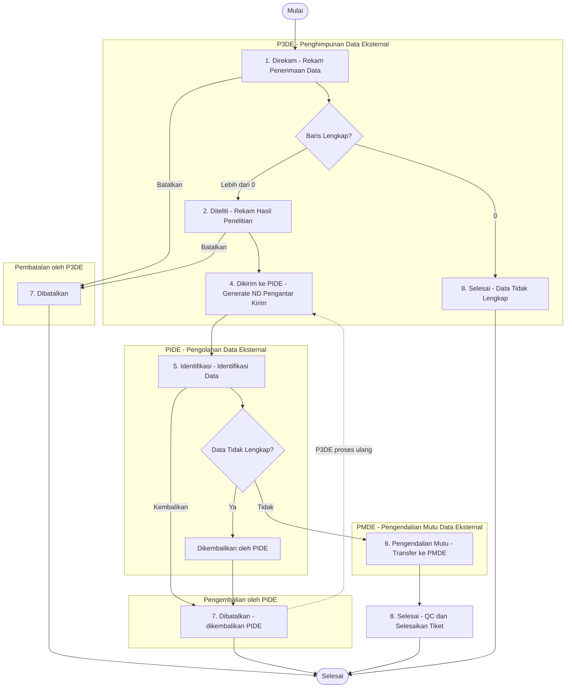

# Diagram Alur Status Tiket

Dokumen ini menjelaskan alur (*workflow*) status tiket pada sistem DIAMOND menggunakan diagram **Mermaid.js**.

---

## Status Tiket

| Kode | Label              | Penanggung Jawab | Deskripsi                                  |
|------|--------------------|------------------|--------------------------------------------|
| 1    | **Direkam**        | P3DE             | Tiket baru direkam oleh PIC P3DE           |
| 2    | **Diteliti**       | P3DE             | Hasil penelitian telah direkam oleh P3DE   |
| 3    | **Dikembalikan**   | —                | *Hanya sebagai action/riwayat audit.* Tidak ada view yang menetapkan status ini ke tiket. Saat PIDE mengembalikan tiket, status berubah menjadi **Dibatalkan (7)**. |
| 4    | **Dikirim ke PIDE**| P3DE             | Tiket dikirim dari P3DE ke PIDE            |
| 5    | **Identifikasi**   | PIDE             | PIDE sedang melakukan identifikasi data    |
| 6    | **Pengendalian Mutu** | PMDE          | PMDE sedang melakukan quality control      |
| 7    | **Dibatalkan**     | P3DE / PIDE      | Tiket dibatalkan oleh P3DE (status < 4) atau dikembalikan oleh PIDE (status 4/5) |
| 8    | **Selesai**        | P3DE / PMDE      | Tiket selesai diproses (PMDE via QC, atau P3DE langsung jika baris_lengkap == 0) |

---

## Diagram Alur (Flowchart)



---

## Penjelasan Alur

### 1. P3DE: Rekam Penerimaan Data
**Status: Direkam (1)**

PIC P3DE memulai workflow dengan merekam data penerimaan melalui menu **Rekam Penerimaan Data** (`/tiket/rekam/`). Pada tahap ini, tiket dibuat dengan data-data seperti:
- Nomor tiket (otomatis)
- Periode data
- ILAP & Jenis Data
- Bentuk data dan cara penyampaian
- Tanggal terima
- Jumlah baris diterima

### 2. P3DE: Rekam Hasil Penelitian
**Status: Ditetapkan berdasarkan kondisi Baris Lengkap**

Setelah tiket direkam, PIC P3DE melakukan penelitian awal dan merekam hasilnya melalui menu **Rekam Hasil Penelitian** (modal di halaman detail tiket). Data yang direkam:
- Status penelitian (otomatis ditentukan dari perbandingan baris)
- Tanggal teliti
- Baris lengkap / tidak lengkap

**Penentuan status berdasarkan `baris_lengkap`:**

| Kondisi                              | Status Penelitian    | Status Tiket              |
|--------------------------------------|----------------------|---------------------------|
| `baris_lengkap == baris_diterima`    | Lengkap              | **Diteliti (2)**          |
| `baris_lengkap > 0` dan tidak penuh  | Lengkap Sebagian     | **Diteliti (2)**          |
| `baris_lengkap == 0`                 | Tidak Lengkap        | **Selesai (8)** (langsung)|

> **Perhatian:** Apabila `baris_lengkap == 0`, tiket langsung berstatus **Selesai (8)** tanpa melalui proses selanjutnya.

### 3. P3DE: Kirim Tiket ke PIDE
**Status: Dikirim ke PIDE (4)**

PIC P3DE mengirim tiket yang sudah diteliti ke PIDE melalui dua langkah:

**Langkah 1 — Generate ND Pengantar PIDE** (`/tiket/kirim-tiket/`):
- Menampilkan daftar tiket dengan status **Diteliti (2)** yang memiliki `tanda_terima=True` dan `baris_lengkap > 0`
- PIC memilih tiket dan menekan tombol **Generate Template**
- Sistem menyimpan data sementara ke tabel `KirimPideTemp` dan menghasilkan dokumen **ND Pengantar PIDE** (format DOCX)

**Langkah 2 — Kirim ke PIDE** (modal dari halaman detail tiket / halaman kirim):
- PIC mengisi data **ND Nadine** (tanggal nadine, nomor ND nadine, tanggal kirim PIDE)
- Sistem mengubah status tiket menjadi **Dikirim ke PIDE (4)**
- Notifikasi dikirim ke PIC PIDE aktif

### 4. PIDE: Identifikasi Data
**Status: Identifikasi (5)**

Setelah menerima tiket dari P3DE (status **Dikirim ke PIDE (4)**), PIC PIDE dapat melakukan dua hal:

- **Proses Identifikasi** — mengubah status menjadi **Identifikasi (5)** melalui menu **Identifikasi** (`/tiket/identifikasi/<pk>/update/`). Kegiatan ini mencatat tanggal rekam PIDE dan membuat *audit trail*.
- **Kembalikan ke P3DE** — apabila data bermasalah (lihat poin 5).

Setelah identifikasi selesai, PIC PIDE mencatat baris identifikasi (I, U, Res, CDE) melalui **Transfer ke PMDE**.

### 5. Opsi: Dikembalikan ke P3DE oleh PIDE
**Aksi: Dikembalikan → Status Tiket: Dibatalkan (7)**

Apabila data tidak lengkap atau bermasalah, PIC PIDE dapat mengembalikan tiket ke P3DE melalui menu **Kembalikan ke P3DE** (modal di halaman detail tiket). Aksi ini tersedia saat tiket berstatus **Dikirim ke PIDE (4)** atau **Identifikasi (5)**.

Sistem akan:
- Mengubah status tiket menjadi **Dibatalkan (7)** (meskipun aksinya bernama "Dikembalikan")
- Mencatat **dua** *audit trail*:
  1. **Dikembalikan** — atas nama PIC PIDE yang mengembalikan
  2. **Dibatalkan** — atas nama PIC P3DE aktif (sebagai penerima pengembalian)
- Mencatat `tgl_dikembalikan` pada tiket
- Mengirim notifikasi ke PIC P3DE aktif

PIC P3DE kemudian dapat memproses ulang tiket yang dibatalkan/dikembalikan tersebut melalui halaman **Generate ND Pengantar PIDE** (jika tiket memenuhi syarat).

> **Catatan:** Status **Dikembalikan (3)** adalah label status yang **tidak pernah ditetapkan** oleh view manapun. Ketika PIDE mengembalikan tiket, status yang digunakan adalah **Dibatalkan (7)**. Label "Dikembalikan" hanya tercatat sebagai *action type* di riwayat *audit trail* (`TiketAction`).

### 6. PIDE: Transfer ke PMDE
**Status: Pengendalian Mutu (6)**

Setelah identifikasi selesai, PIC PIDE mentransfer tiket ke PMDE melalui menu **Transfer ke PMDE** (modal di halaman detail tiket). Aksi ini tersedia saat tiket berstatus **Identifikasi (5)**. Data yang dicatat:
- Jumlah baris I (Identifikasi)
- Jumlah baris U (Update)
- Jumlah baris Res (Residual)
- Jumlah baris CDE

Sistem akan:
- Mengubah status tiket menjadi **Pengendalian Mutu (6)**
- Mengirim notifikasi ke PIC PMDE aktif

### 7. PMDE: Selesaikan Tiket (Quality Control)
**Status: Pengendalian Mutu (6) → Selesai (8)**

PIC PMDE menyelesaikan tiket melalui menu **Selesaikan Tiket** (modal di halaman detail tiket). Aksi ini tersedia saat tiket berstatus **Pengendalian Mutu (6)**. Data QC yang dicatat:
- Jumlah baris sudah QC dan belum QC
- Jumlah baris lolos QC dan tidak lolos QC
- Klasifikasi QC (P, X, W, F, A, C, N, Y, Z, U, E, V, R, D)

Sistem akan membuat **dua** *audit trail* dalam satu transaksi:
1. **Pengendalian Mutu** — mencatat ringkasan QC
2. **Selesai** — menandai penyelesaian tiket

Setelah itu, status tiket berubah menjadi **Selesai (8)**, yang merupakan tahap akhir dari *workflow*.

### Pembatalan oleh P3DE

PIC P3DE dapat membatalkan tiket melalui menu **Batalkan Tiket** (modal di halaman detail tiket). Tiket yang dibatalkan akan berstatus **Dibatalkan (7)**.

**Ketentuan:**
- Hanya dapat dilakukan jika status tiket **sebelum dikirim ke PIDE**, yaitu status **Direkam (1)** atau **Diteliti (2)**
- Setelah tiket dikirim ke PIDE (status ≥ 4), P3DE **tidak dapat** membatalkan tiket

---

## Ringkasan Alur Normal

```
Direkam (1) → Diteliti (2) → Dikirim ke PIDE (4) → Identifikasi (5) → Pengendalian Mutu (6) → Selesai (8)
```

## Alur Langsung Selesai

```
Direkam (1) → Selesai (8)
(Ketika baris_lengkap == 0 — data tidak tersedia sama sekali)
```

## Alur Alternatif (Pengembalian oleh PIDE)

```
Direkam (1) → Diteliti (2) → Dikirim ke PIDE (4) → Identifikasi (5)
                                                      ↓ (tidak lengkap)
                                                 Dibatalkan (7) — status "Dikembalikan" 
                                                 di catat sebagai aksi audit
                                                 ↓
                                                 P3DE proses ulang via Kirim ke PIDE
```

## Alur Pembatalan

```
P3DE: Direkam (1) atau Diteliti (2) → Dibatalkan (7)
PIDE: Dikirim ke PIDE (4) atau Identifikasi (5) → Dibatalkan (7) (dikembalikan)
```
